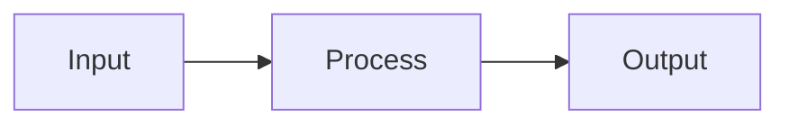

# MkDocs Best Practices

A reference for getting the most out of MkDocs and Material for MkDocs — covering configuration, theming, plugins, workflow, and anti-patterns.

---

## 1. Features and Configuration Worth Using

### Strict Mode

Build with `strict: true` in `mkdocs.yml` to turn warnings into errors. This catches broken links, orphan pages, and missing references before they reach production.

```yaml
strict: true
```

Run `mkdocs build --strict` in CI as a gate. Warnings during `mkdocs serve` are real problems — fix them before they accumulate.

### Validation Settings

MkDocs 1.6+ provides granular validation for links and navigation:

```yaml
validation:
  nav:
    omitted_files: warn
    not_found: warn
  links:
    not_found: warn
    anchors: warn
    absolute_links: warn
    unrecognized_links: warn
```

This catches dead anchors, absolute paths (which break on deployment), and unrecognized link formats.

### Draft Docs

Use `draft_docs` to keep work-in-progress pages visible during `mkdocs serve` but excluded from production builds:

```yaml
draft_docs:
  - drafts/
```

### Environment Variable Substitution

Use the `!ENV` YAML tag for values that change between environments:

```yaml
site_url: !ENV [SITE_URL, 'https://joellarson.github.io/knowledge/']
```

Supports fallback chains: `!ENV [PRIMARY_VAR, FALLBACK_VAR, 'default']`.

### Configuration Inheritance

For multi-environment setups, use `INHERIT` to create a base config with overrides:

```yaml
# mkdocs.production.yml
INHERIT: mkdocs.yml
site_url: https://production.example.com/
strict: true
```

### Exclude and Not-in-Nav

Control what gets built without cluttering the nav:

```yaml
exclude_docs: |
  drafts/
  *.tmp

not_in_nav: |
  internal/**
```

`not_in_nav` suppresses the "page not in nav" warning for pages intentionally left out of navigation (but still built and linkable).

### Watch Directories

During development, watch directories outside `docs/` for changes:

```yaml
watch:
  - hooks/
  - overrides/
```

### Hooks (Lightweight Plugins)

For project-specific transformations that don't warrant a full plugin package, use hooks — Python scripts that receive the same lifecycle events as plugins:

```yaml
hooks:
  - hooks/my_hook.py
```

```python
# hooks/my_hook.py
def on_page_markdown(markdown, page, config, files):
    return markdown.replace('TODO', '**TODO**')
```

Hooks live in your repo, require no packaging or entry points, and are ideal for one-off build logic.

---

## 2. Anti-Patterns

### Configuration

| Anti-Pattern | Why It Hurts | Fix |
|---|---|---|
| Not using `strict: true` | Broken links and orphan pages silently accumulate | Enable strict mode; enforce in CI |
| Enormous `nav:` section | Manually listing hundreds of pages is unmaintainable | Use `mkdocs-awesome-pages-plugin` or `mkdocs-literate-nav` for subdirectories |
| Not pinning dependency versions | Builds break when upstream releases land | Pin exact versions in `pyproject.toml` |
| Missing `site_url` | Sitemaps, canonical URLs, social cards, and search misbehave | Always set `site_url` |
| Plugin ordering ignored | Plugins execute in listed order; wrong order causes silent failures | Put content-generation plugins (macros, mkdocstrings) before post-processing plugins |

### Content

| Anti-Pattern | Why It Hurts | Fix |
|---|---|---|
| Deep nesting (4+ levels) | Content becomes hard to discover | Flatten to 3 levels max |
| Orphan pages | Pages in `docs/` but not in nav are invisible to readers | Add to nav, or use `not_in_nav` intentionally |
| Large binaries in `docs/` | Repo bloat, slow clones | Use a CDN, git-lfs, or compress images |
| Assuming GitHub-Flavored Markdown | Python-Markdown is not GFM; `~~strikethrough~~` needs `pymdownx.tilde`, checklists need `pymdownx.tasklist` | Enable the specific pymdownx extensions you need |
| Absolute paths in links | Break on deployment when site is at a subpath | Use relative paths between Markdown files |

### Build and Deployment

| Anti-Pattern | Why It Hurts | Fix |
|---|---|---|
| `mkdocs gh-deploy` from local machines | Non-reproducible, non-auditable deploys | Deploy from CI exclusively |
| Ignoring `mkdocs serve` warnings | Warnings are real problems deferred | Treat warnings as errors locally too |
| Not testing the build in CI | Broken builds discovered only at deploy time | Add `mkdocs build --strict` as a CI step |

### Theme Customization

| Anti-Pattern | Why It Hurts | Fix |
|---|---|---|
| Overriding `main.html` entirely | Maintenance burden on every Material update | Override specific blocks only |
| Overriding many partials | Creates tight coupling to theme internals | Prefer `extra_css`, hooks, and plugins |
| Forking the theme for small changes | Lose upstream updates entirely | Use `custom_dir` with targeted overrides |

### Plugin-Specific Gotchas

- **`navigation.instant` breaks third-party JS.** SPA-style navigation means `DOMContentLoaded` fires only once. Use Material's `document$` observable instead:

    ```javascript
    document$.subscribe(function() {
      // Re-initialize third-party libraries here
    })
    ```

- **`mkdocs-macros` Jinja2 conflicts.** If your Markdown contains literal `{{ }}` or `` (Terraform, Ansible, Jinja templates in code blocks), macros will try to evaluate them. Fix with `...` blocks or set `render_macros: false` in page front matter.

- **`git-revision-date-localized` requires full git history.** In CI, shallow clones (the default) produce incorrect or missing dates. Add `fetch-depth: 0` to the checkout step. Files not yet committed to git produce warnings but do not fail `--strict`.

- **`navigation.indexes` and duplicate nav entries.** When `navigation.indexes` is enabled, a section's `index.md` should be listed *without a title* in the nav — just the bare path. Listing it with a title (e.g., `- Overview: section/index.md`) creates a duplicate entry alongside the section heading. Correct form:

    ```yaml
    nav:
      - Section Name:
        - section/index.md          # folds into the section heading
        - Page Title: section/page.md
    ```

- **`strict: true` + `omitted_files: warn` = mandatory nav coverage.** With both enabled, every file in `docs/` must appear in the `nav:` section, be listed in `not_in_nav`, or be excluded via `exclude_docs`. Orphan pages fail the build. This is the desired behavior — but it means new pages must be added to nav immediately, not deferred.

### uv / Build Tool Gotchas

- **`uv run mkdocs` can resolve to a global tool install.** If you've previously run `uv tool install mkdocs`, the `uv run mkdocs` command may resolve to the tool's isolated environment instead of the project's virtual environment. Plugins installed as project dependencies won't be found, producing confusing "plugin is not installed" errors even though `uv pip list` shows them. Use `uv run python -m mkdocs` to guarantee the project venv is used. This applies to both local development and CI.

- **Add a `Makefile` to wrap local invocations.** Rather than typing `uv run python -m mkdocs build --strict` every time, a two-target `Makefile` gives you `make build` and `make serve` as shorthands — the same ergonomic pattern as `npm run build`/`npm run dev` in JS projects:

    ```makefile
    .PHONY: build serve

    build:
        uv run python -m mkdocs build --strict

    serve:
        uv run python -m mkdocs serve
    ```

---

## 3. Improving Readability and Ease of Use

### Markdown Extensions to Enable

These extensions are broadly useful and have no downside:

```yaml
markdown_extensions:
  - admonition                    # Callout blocks (note, tip, warning, danger)
  - pymdownx.details              # Collapsible admonitions
  - pymdownx.superfences:         # Enhanced fenced code + Mermaid diagrams
      custom_fences:
        - name: mermaid
          class: mermaid
          format: !!python/name:pymdownx.superfences.fence_code_format
  - pymdownx.tabbed:              # Tabbed content blocks
      alternate_style: true
  - pymdownx.highlight:           # Code syntax highlighting
      anchor_linenums: true
  - pymdownx.inlinehilite         # Inline code highlighting
  - pymdownx.snippets             # Include content from other files
  - pymdownx.critic               # Track changes markup
  - pymdownx.caret                # Superscript (^text^)
  - pymdownx.keys                 # Keyboard key rendering (++ctrl+c++)
  - pymdownx.mark                 # Highlighted text (==marked==)
  - pymdownx.tilde                # Strikethrough and subscript
  - attr_list                     # Add HTML attributes to elements
  - md_in_html                    # Markdown inside HTML blocks
  - def_list                      # Definition lists
  - footnotes                     # Footnotes
  - tables                        # Tables
  - toc:
      permalink: true             # Permanent links on headers
```

### Navigation Features

Material provides these as feature flags in `theme.features`:

| Feature | Effect |
|---|---|
| `navigation.instant` | SPA-like page transitions (no full reload) |
| `navigation.instant.progress` | Loading progress bar for slow connections |
| `navigation.tracking` | URL updates to anchor as user scrolls |
| `navigation.tabs` | Top-level sections rendered as tabs |
| `navigation.sections` | Sections rendered as groups in the sidebar |
| `navigation.expand` | Sidebar sections expanded by default |
| `navigation.indexes` | Section headings can themselves be pages |
| `navigation.top` | Back-to-top button |
| `navigation.path` | Breadcrumb trail |
| `search.suggest` | Search autocomplete |
| `search.highlight` | Highlight search terms on the target page |
| `search.share` | Shareable deep links to search queries |
| `content.code.copy` | Copy button on code blocks |
| `content.code.select` | Line selection in code blocks |
| `content.tabs.link` | Linked tabs sync across the page |

### Content Patterns for Readability

**Admonitions** for callouts instead of bold text:

```markdown
!!! tip "Key Insight"
    Admonitions draw the eye without interrupting flow.

??? note "Collapsible Detail"
    Expand for more. Uses `pymdownx.details`.
```

**Content tabs** for language-specific or variant content:

```markdown
=== "Python"
    ```python
    print("hello")
    ```

=== "JavaScript"
    ```javascript
    console.log("hello")
    ```
```

**Mermaid diagrams** for architecture and flow:

````markdown

````

**Definition lists** for glossaries and term definitions:

```markdown
Term
:   Definition of the term
```

### Section Index Pages

With `navigation.indexes` enabled, a section's `index.md` becomes both the section landing page and the section heading in the sidebar. This eliminates the awkward pattern of having a section with a separate "Overview" page inside it.

---

## 4. Theme Customization

### Approach Hierarchy

Prefer lighter-touch approaches. Escalate only when needed:

1. **`extra_css` / `extra_javascript`** — Add custom stylesheets or scripts. Loaded after theme defaults. Safest and most upgrade-resistant.
2. **Hooks** — Python scripts for build-time transformations. No packaging needed.
3. **`custom_dir` with block overrides** — Override specific template blocks by creating `overrides/main.html` that extends `base.html`.
4. **`custom_dir` with partial overrides** — Replace specific template partials (e.g., `overrides/partials/footer.html`). More fragile — partials change between Material versions.
5. **Full theme fork** — Last resort. You lose upstream updates entirely.

### Block Overrides

Create `overrides/main.html` to surgically modify specific blocks:

```jinja2



  <div class="announce-bar">Beta documentation — feedback welcome</div>

```

Use `{{ super() }}` to extend rather than replace:

```jinja2



  {{ super() }}
  <link rel="preload" href="/fonts/custom.woff2" as="font" crossorigin>

```

Available blocks: `analytics`, `announce`, `config`, `container`, `content`, `extrahead`, `fonts`, `footer`, `header`, `hero`, `htmltitle`, `libs`, `outdated`, `scripts`, `site_meta`, `site_nav`, `styles`, `tabs`.

### Custom CSS Best Practices

- Use CSS custom properties (variables) defined by Material rather than overriding selectors directly. Material exposes `--md-primary-fg-color`, `--md-accent-fg-color`, `--md-default-fg-color`, etc.
- Scope custom styles narrowly. Avoid `!important`.
- Respect `prefers-reduced-motion` and `prefers-color-scheme` media queries.
- Test in both light and dark modes.

### Custom JavaScript

When `navigation.instant` is enabled, use Material's observable API instead of DOM load events:

```javascript
// Correct — works with instant navigation
document$.subscribe(function() {
  // Initialize or re-initialize libraries here
})
```

```javascript
// Wrong — fires only once with navigation.instant
document.addEventListener("DOMContentLoaded", function() { ... })
```

---

## 5. Development Workflow

### Local Development

```bash
# Start the dev server with live reload
mkdocs serve

# Serve on a specific address/port
mkdocs serve --dev-addr 0.0.0.0:8080

# Serve with strict mode (treat warnings as errors)
mkdocs serve --strict

# Serve with draft docs excluded (production preview)
mkdocs serve --clean
```

`mkdocs serve` watches the `docs/` directory and `mkdocs.yml` for changes, rebuilding and reloading the browser automatically. Add additional watch paths with the `watch` config key.

### Building

```bash
# Production build
mkdocs build

# Strict build (recommended for CI)
mkdocs build --strict

# Build with dirty reload (only rebuild changed pages — faster, but incomplete)
mkdocs build --dirty

# Clean build (remove stale files)
mkdocs build --clean
```

Output goes to `site/` by default. The `--dirty` flag is useful for large sites during development but should never be used for production builds — it can leave stale pages behind.

### Deployment

```bash
# Deploy to GitHub Pages (pushes to gh-pages branch)
mkdocs gh-deploy

# Deploy with explicit remote
mkdocs gh-deploy --remote-name origin --remote-branch gh-pages
```

**Prefer CI-based deployment over local `gh-deploy`.** A GitHub Actions workflow is more reproducible and auditable:

```yaml
# .github/workflows/deploy.yml
name: Deploy docs
on:
  push:
    branches: [main]
jobs:
  build:
    runs-on: ubuntu-latest
    steps:
      - uses: actions/checkout@v6
        with:
          fetch-depth: 0        # Required for git-revision-date-localized
      - uses: astral-sh/setup-uv@v5
      - run: uv run python -m mkdocs build --strict
      - uses: actions/upload-pages-artifact@v5
        with:
          path: site
  deploy:
    needs: build
    runs-on: ubuntu-latest
    steps:
      - uses: actions/deploy-pages@v5
```

Note `python -m mkdocs` instead of bare `mkdocs` — see the uv gotcha in [Anti-Patterns](#uv-build-tool-gotchas) above.

### Recommended Workflow

1. **Write** — Edit Markdown files with `mkdocs serve` running
2. **Preview** — Check the dev server; fix any warnings
3. **Commit** — Treat docs as code; same PR review process
4. **CI builds** — `mkdocs build --strict` gates the merge
5. **Deploy** — Automated via GitHub Actions on push to main

---

## 6. Useful Plugins

### Recommended for Most Projects

| Plugin | What It Does | Install |
|---|---|---|
| **mkdocs-awesome-pages** | Control nav ordering with `.pages` files per directory instead of a giant `nav:` in config | `pip install mkdocs-awesome-pages-plugin` |
| **mkdocs-macros** | Jinja2 templating in Markdown — variables, macros, filters | `pip install mkdocs-macros-plugin` |
| **mkdocs-redirects** | Create redirects when pages move; preserves old URLs | `pip install mkdocs-redirects` |
| **mkdocs-git-revision-date-localized** | Show "last updated" and "created" dates from git history | `pip install mkdocs-git-revision-date-localized-plugin` |
| **mkdocs-minify** | Minify HTML/CSS/JS output for smaller page sizes | `pip install mkdocs-minify-plugin` |
| **mkdocs-glightbox** | Click-to-zoom lightbox for images | `pip install mkdocs-glightbox` |

### Recommended for Specific Needs

| Plugin | What It Does | When to Use |
|---|---|---|
| **mkdocstrings** | Auto-generate API docs from source code docstrings | When documenting a library or framework |
| **mkdocs-gen-files** | Programmatically generate pages during build | Auto-generating reference pages, indexes |
| **mike** | Documentation versioning via git branches | When shipping versioned software |
| **mkdocs-monorepo** | Include docs from multiple repos/directories | Microservice or monorepo documentation |
| **mkdocs-include-markdown** | Include content from other Markdown or text files | DRY content, shared snippets across pages |
| **mkdocs-table-reader** | Read tables from CSV/Excel files | Data-driven documentation |
| **mkdocs-literate-nav** | Define navigation in Markdown instead of YAML | When nav structure is complex and YAML is awkward |

### Material Insiders Plugins (Paid Sponsorship)

| Plugin | What It Does |
|---|---|
| **blog** | Full blogging engine with archives, categories, pagination |
| **social** | Auto-generated Open Graph images from page titles |
| **tags** | Tagging system with tag index pages |
| **privacy** | Self-hosts external assets for GDPR compliance |
| **optimize** | Image compression and unused CSS removal |
| **meta** | Set front matter defaults per directory |
| **projects** | Multi-project / monorepo documentation |
| **typeset** | Preserve rich formatting in navigation and TOC |

### Plugin Ordering

Plugins execute in the order listed in `mkdocs.yml`. General rule: **content-generating plugins first, post-processing plugins last**.

```yaml
plugins:
  - search                        # Built-in, should stay first
  - macros                        # Expands variables before other processing
  - awesome-pages                 # Modifies navigation
  - git-revision-date-localized   # Adds metadata
  - minify:                       # Post-processing — must be last
      minify_html: true
```

---

## 7. Custom Plugins for This Project

Given the structure of this Knowledge base — a growing collection of topic wikis with rich metadata, cross-references, and structured frontmatter — these custom plugins (or hooks) would add value:

### Frontmatter Validator

A hook that enforces the wiki schema (`title`, `type`, `tags`, `created`, `updated`, `sources`) on content pages. Fails the build under `--strict` if required fields are missing.

**Scope the hook by path prefix.** Different sections of a site may have different schemas (e.g., a TDD wiki requires `sources`, a best-practices section does not). A global validator that assumes one schema will produce false positives across sections. Filter by `src_path` prefix so each section enforces only its own rules.

**Skip non-content pages.** Section indexes (`index.md`) and append-only logs (`log.md`) are structural pages that don't carry the full schema.

```python
# hooks/validate_frontmatter.py
from mkdocs.exceptions import PluginError

REQUIRED_FIELDS = ("title", "type", "tags", "created", "updated", "sources")
SKIP_FILES = {"index.md", "log.md"}

def on_page_markdown(markdown, page, config, files):
    src = page.file.src_path

    # Only validate pages under the wiki section
    if not src.startswith("test-driven-development/"):
        return markdown

    # Skip section indexes and logs
    if src.endswith(tuple(SKIP_FILES)):
        return markdown

    missing = [f for f in REQUIRED_FIELDS if f not in page.meta]
    if missing:
        raise PluginError(
            f"{src}: missing required frontmatter fields: {', '.join(missing)}"
        )

    return markdown
```

### Cross-Reference Index Generator

A hook or plugin that scans all pages for internal links and generates a "backlinks" section or a cross-reference index page — showing which concepts reference which entities and sources.

### Tag Index Page

A hook that reads `tags` from frontmatter and generates a tag index page (or per-tag pages) listing all pages with each tag. Useful for browsing concepts by topic rather than by the nav tree.

### Stale Content Detector

A hook that compares `updated` frontmatter dates against a threshold and flags pages that may need review. Could emit warnings during build or generate a "stale pages" report.

### Source Coverage Report

A hook that cross-references `sources` frontmatter across concept pages against the list of ingested books/papers. Identifies which sources are heavily cited and which have untapped content.

### Reading Time Estimator

A hook that calculates word count and estimated reading time, injecting it into the page context (visible via a template override or macro).

```python
# hooks/reading_time.py
import math

def on_page_context(context, page, config, nav):
    words = len(page.markdown.split())
    page.meta['reading_time'] = max(1, math.ceil(words / 200))
    page.meta['word_count'] = words
    return context
```

### Auto-Navigation from Directory Structure

Given that the `nav:` section in `mkdocs.yml` currently lists all 180+ pages manually, a move to `mkdocs-awesome-pages-plugin` with `.pages` files per directory would eliminate the maintenance burden. Alternatively, a custom hook could generate nav from the directory structure with ordering derived from frontmatter metadata.

---

## Appendix: Current Project Configuration

This project uses:

- **Material theme** with dark/light mode toggle
- **Instant navigation** with progress bar and URL tracking
- **Search** with suggestions, highlighting, and sharing
- **Code blocks** with copy and select
- **Full pymdownx suite** — highlight, superfences (with Mermaid), tabbed, details, snippets, critic, caret, keys, mark, tilde
- **Rich Markdown** — attr_list, md_in_html, def_list, footnotes, tables
- **Strict mode** with full link/nav validation
- **Plugins** — search, git-revision-date-localized, glightbox
- **Build hook** — frontmatter validation scoped to the TDD wiki section
- **Custom CSS** with accessibility considerations (WCAG AA, `prefers-reduced-motion`)
- **CI/CD deployment** via GitHub Actions with uv, `--strict` gate, `fetch-depth: 0`
- **Structured frontmatter** on all content pages, enforced by hook

### Remaining Opportunities

| Area | Current State | Improvement |
|---|---|---|
| Nav maintenance | 190+ pages listed manually in `mkdocs.yml` | Use `awesome-pages` with `.pages` files per directory |
| Type validation in hook | Hook checks field presence only | Add `type` value validation (`concept`, `entity`, `source`, etc.) |
| Multi-section schemas | Hook hardcodes `test-driven-development/` prefix | Generalize to a config-driven schema map as new sections are added |
